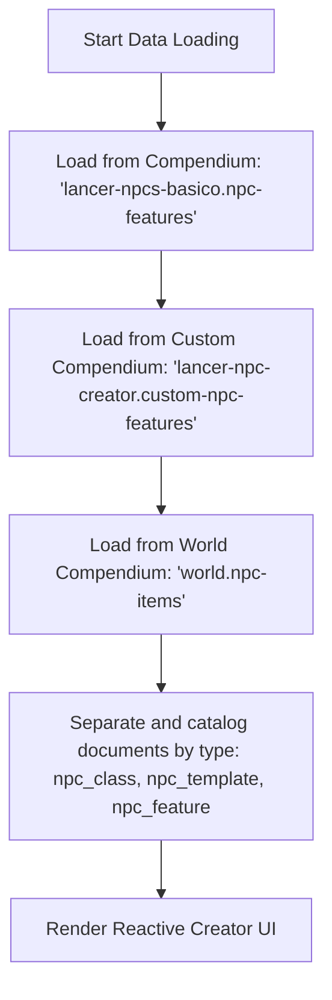

# Lancer NPC Creator 🤖

**Lancer NPC Creator** is an independent module for **Foundry VTT (compatible with Version 13)** developed using the new **ApplicationV2** architecture. It provides a reactive design interface for rapid creation of Non-Player Characters (NPCs) for the *Lancer* RPG system.

This tool integrates natively into Foundry VTT's Actor Directory, allowing Game Masters (GMs) to design and configure NPCs with dynamic stats adjusted by Tier and Templates, featuring real-time preview updates before spawning the actor in the world.

> [!IMPORTANT]
> **No Third-Party Content Included:** This module **does not** include any copyrighted, intellectual property, or third-party content (such as NPC stats, classes, or templates from the Lancer core books). It is a pure software utility. To function, it depends on external compendiums loaded from your active game system or other active modules (e.g., the `lancer-npcs-basico` module).

---

## 🚀 How the Compendium Logic Works

The module operates by loading data from three specific compendiums inside the `_renderHTML()` method. This ensures that the official features, the custom features defined in the module, and world-specific items are correctly imported into the NPC Creator:

### 1. Features Compendium (`lancer-npcs-basico.npc-features`)
*   The module accesses the compendium containing the features from the core book.
*   If it is active and accessible, all of its documents are read and categorized according to their type (`npc_class`, `npc_template`, or `npc_feature`).

### 2. Custom Features Compendium (`lancer-npc-creator.custom-npc-features`)
*   The module loads custom features saved by the GM directly into the compendium natively created by this module itself.
*   Any new NPC classes, additional templates, or custom features inserted there are automatically and seamlessly merged with the official records.

### 3. World Items Compendium (`world.npc-items`)
*   The module also dynamically loads items saved directly inside the world's own compendium (`world.npc-items`).
*   This allows you to seamlessly bring NPC classes, templates, or resources defined specifically for your current game world straight into the creator interface.

---

## 📖 How to Use

1. **Compendium Requirements:**
   Make sure the data (NPC Classes, Templates, and Features) is available in your world through the compendiums: `lancer-npcs-basico.npc-features`, `lancer-npc-creator.custom-npc-features` and `world.npc-items`.

2. **Opening the Creator:**
   * Go to the **Actors** tab in Foundry VTT's sidebar.
   * Click the **NPC Creator** button located at the top of the sidebar.

3. **Configuring your NPC:**
   * **Filter by Role:** Filter shown classes by combat roles (e.g., *Striker*, *Support*, *Defender*).
   * **Base Class:** Select the NPC class to act as the base chassis.
   * **Tier:** Choose the combat Tier (I, II, or III). The preview grid on the right updates base stats instantly.
   * **Apply Templates:** Toggle one or more templates (e.g., *Elite*, *Ultra*, *Veteran*) to apply cumulative bonuses to hit points, structure, stress, and activations.
   * **Optional Features:** Toggle additional optional features to customize the NPC's ability loadout.

4. **Spawning in World:**
   * Click **Generate NPC in World** in the preview panel.
   * The module will instantly create the actor in your sidebar, attach all selected items, and open the fully configured NPC sheet ready for action!

---

## ⚙️ Key Features and Business Rules

*   **Reactive Selection & Filtering:** Allows filtering NPC classes by their combat role (*Striker*, *Support*, *Defender*, etc.).
*   **Dynamic Tier Adjustments:** When changing the Combat Tier (I, II, or III), all base stats of the NPC are recalculated automatically according to the corresponding class's stat tables.
*   **Application of Templates with Cumulative Bonuses:** 
    *   Templates like **Elite**, **Ultra**, **Veteran**, **Commander**, and **Grunt** dynamically alter the character sheet.
    *   The UI adds bonuses for Structure, Stress, and extra Activations per round.
    *   The logic applies direct stat bonuses added by equipped features.
    *   Features support overrides, such as the **Grunt** template which automatically forces Hit Points (HP) to 1, and Structure/Stress to 0.
*   **Intelligent Optional Features:** As you select new templates or classes, the valid optional features for that specific combination are dynamically displayed in the left column for customization.
*   **Native V13 Integration (ApplicationV2):** The "NPC Creator" button is dynamically injected into the header of the Actor Directory in a way that is fully compatible with Foundry VTT's new API.
*   **World Instantiation:** The "Generate NPC in World" button instantly creates an actor of type `npc`, compiles all selected items (Class, Templates, and active Features) directly onto the actor's sheet, names it according to the configuration, and automatically opens the new sheet for the GM.

---

## 🛠️ Project Structure

*   `module.json`: The module manifest indicating the ESModule script dependency, CSS styles, compatibility with Foundry VTT V13+, definition of empty compendiums, package recommendations, and registered language files.
*   `scripts/npc-creator.mjs`: Contains all the reactive rendering logic, event listeners, dynamic NPC stat calculation via `game.i18n`, and smart compendium loading.
*   `styles/npc-creator.css`: Modern and reactive styling inspired by *Lancer*'s tactical and futuristic interface.
*   `lang/`: Directory containing JSON translation files for the creator's dynamic localization:
    *   `pt-BR.json`: Original Portuguese Brazilian translation keys and terms.
    *   `en.json`: English translation keys and adapted game terminology.
*   `packs/custom-npc-features/`: Directory hosting the empty item compendium **`lancer-npc-creator.custom-npc-features`** ("Criador de PNJ - Características Customizadas") available natively to be filled by the user with their own custom classes, templates, or features.

---

## 🤖 Generative AI Content Declaration
This module was developed with the assistance of Generative AI tools (such as Antigravity by Google). For more details on the scope of assistance and compliance with Foundry VTT guidelines, please consult our [Generative AI Content Declaration](file:///c:/Users/lpfon/AppData/Local/FoundryVTT/Data/modules/lancer-npc-creator/GEN-AI-DECLARATION.md).
