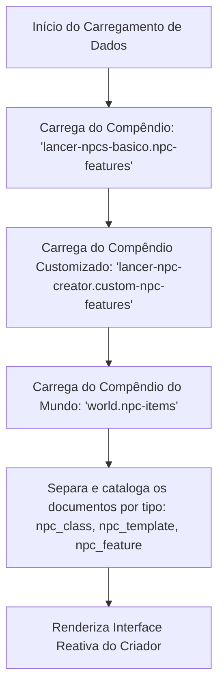

# Lancer NPC Creator 🤖

O **Lancer NPC Creator** é um módulo independente para **Foundry VTT (compatível com a Versão 13)** desenvolvido utilizando a nova arquitetura **ApplicationV2**. Ele fornece uma interface reativa de design e criação rápida de Personagens Não-Jogadores (PNJs/NPCs) para o sistema de RPG *Lancer*.

Esta ferramenta se integra nativamente ao diretório de Atores (Actor Directory) do Foundry VTT, permitindo que Mestres de Jogo (GMs) criem e configurem PNJs com estatísticas dinâmicas ajustadas por Tier e Modelos (Templates), com atualização em tempo real antes da geração do ator no mundo.

> [!IMPORTANT]
> **Sem Conteúdo de Terceiros Incluso:** Este módulo **não contém** propriedade intelectual, regras protegidas por direitos autorais ou conteúdo de terceiros (como estatísticas, classes ou modelos de PNJs dos livros oficiais de Lancer). Ele é puramente uma ferramenta de software. Para funcionar, ele depende de compêndios externos carregados do seu sistema de jogo ativo ou de outros módulos (como o módulo `lancer-npcs-basico`).

---

## 🚀 Como Funciona a Lógica de Compêndio

O módulo opera carregando dados de três compêndios específicos no método `_renderHTML()`. Isso garante que as características oficiais, as customizadas no módulo e os itens do mundo sejam importados para o Criador de PNJ:

### 1. Compêndio de Características (`lancer-npcs-basico.npc-features`)
*   O módulo acessa o compêndio contendo as características do livro básico.
*   Se estiver ativo e acessível, todos os seus documentos são lidos e categorizados de acordo com seu tipo (`npc_class`, `npc_template` ou `npc_feature`).

### 2. Compêndio de Características Customizadas (`lancer-npc-creator.custom-npc-features`)
*   O módulo carrega as características personalizadas salvas pelo GM diretamente no compêndio criado nativamente pelo próprio módulo.
*   Quaisquer novas classes de PNJ, modelos adicionais ou características customizadas inseridas ali são mescladas com os registros de forma automática e transparente.

### 3. Compêndio de Itens do Mundo (`world.npc-items`)
*   O módulo também carrega dinamicamente os itens salvos diretamente no compêndio do próprio mundo (`world.npc-items`).
*   Isso permite que você traga classes de PNJ, modelos ou recursos definidos especificamente no seu jogo atual diretamente para a interface de criação de forma nativa.

---

## 📖 Como Usar

1. **Requisitos de Compêndio:**
   Certifique-se de que os dados (Classes de PNJs, Modelos e Características) estejam disponíveis nos compêndios `lancer-npcs-basico.npc-features`, `lancer-npc-creator.custom-npc-features` e `world.npc-items`.

2. **Abrindo o Criador:**
   * Acesse a aba **Atores (Actors)** na barra lateral do Foundry VTT.
   * Clique no botão **Criador de PNJ (NPC Creator)** localizado no topo da barra.

3. **Configurando o PNJ:**
   * **Filtrar por Função:** Se desejar, filtre as classes mostradas pelo seu papel de combate (ex: *Striker*, *Support*, *Defender*).
   * **Classe Base:** Selecione a classe do PNJ que servirá como base do chassi.
   * **Patamar (Tier):** Escolha o Patamar de combate (I, II ou III). A grade de atributos do lado direito será recalculada automaticamente na hora.
   * **Aplicar Modelos (Templates):** Ative um ou mais modelos (como *Elite*, *Ultra*, *Veterano*) para adicionar bônus cumulativos de vida, estrutura, estresse e ativações à criatura.
   * **Características Opcionais:** Selecione características opcionais na lista para customizar o conjunto de habilidades do PNJ.

4. **Gerando no Mundo:**
   * Clique em **Gerar PNJ no Mundo** na coluna de preview.
   * O módulo irá gerar instantaneamente o ator na sua barra lateral, anexar todos os itens e abrir a ficha de PNJ completa pronta para o combate!

---

## ⚙️ Principais Funcionalidades e Regras de Negócio

*   **Seleção e Filtragem Reativa:** Permite filtrar classes de PNJ pela sua função em combate (*role*) como *Striker*, *Support*, *Defender*, etc.
*   **Ajuste Dinâmico de Patamar (Tier):** Ao alterar o Patamar (I, II ou III), todos os atributos base do PNJ são recalculados automaticamente de acordo com as tabelas de atributos da classe correspondente.
*   **Aplicação de Modelos (Templates) com Bônus Cumulativos:** 
    *   Modelos como **Elite**, **Ultra**, **Veterano**, **Comandante** e **Peão** alteram dinamicamente a ficha.
    *   A interface adiciona bônus de Estrutura, Estresse e Ativações adicionais na rodada.
    *   A lógica aplica bônus diretos em estatísticas adicionados por características equipadas.
    *   Possui suporte a sobrescritas (*overrides*), como o modelo **Peão** que força automaticamente os Pontos de Vida (PV) para 1, e Estrutura/Estresse para 0.
*   **Características Opcionais Inteligentes:** Conforme você seleciona novos modelos ou classes, as características opcionais válidas para aquela combinação são exibidas dinamicamente na coluna esquerda para personalização.
*   **Integração Nativa V13 (ApplicationV2):** O botão "Criador de PNJ" é injetado dinamicamente no cabeçalho do diretório de Atores de forma compatível com a nova API do Foundry VTT.
*   **Instanciação no Mundo:** O botão "Gerar PNJ no Mundo" cria instantaneamente um ator do tipo `npc`, compila todos os itens (Classe, Modelos e Características selecionadas) diretamente na ficha do ator, nomeia-o de acordo com a configuração e abre a nova ficha automaticamente para o Mestre.

---

## 🛠️ Estrutura do Projeto

*   `module.json`: Manifesto do módulo indicando a dependência do script ESModule, estilos CSS, compatibilidade com o Foundry VTT V13+, definição do compêndio vazio, recomendação de pacotes e registro de idiomas suportados.
*   `scripts/npc-creator.mjs`: Contém toda a lógica de renderização reativa, listeners de eventos, cálculo dinâmico de atributos do PNJ com `game.i18n` e carregamento inteligente dos compêndios.
*   `styles/npc-creator.css`: Estilização moderna e reativa inspirada na interface futurista e tática do *Lancer*.
*   `lang/`: Diretório contendo os arquivos JSON de tradução para a localização dinâmica do criador:
    *   `pt-BR.json`: Tradução e chaves originais em Português do Brasil.
    *   `en.json`: Tradução e chaves completas adaptadas em Inglês.
*   `packs/custom-npc-features/`: Diretório que hospeda o compêndio vazio de itens **`lancer-npc-creator.custom-npc-features`** ("Criador de PNJ - Características Customizadas") disponível nativamente para ser preenchido pelo usuário com suas próprias classes, modelos ou características customizadas.

---

## 🤖 Declaração de Uso de IA / Generative AI Declaration
Este módulo foi desenvolvido com o auxílio de ferramentas de IA Generativa (como o Antigravity desenvolvido pela Google). Para mais detalhes sobre o escopo e conformidade com as diretrizes do Foundry VTT, consulte a nossa [Declaração de Conteúdo de IA Generativa](file:///c:/Users/lpfon/AppData/Local/FoundryVTT/Data/modules/lancer-npc-creator/GEN-AI-DECLARATION.md).
