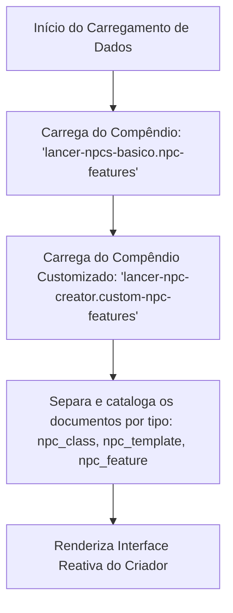

# Lancer NPC Creator 🤖

O **Lancer NPC Creator** é um módulo independente para **Foundry VTT (compatível com a Versão 13)** desenvolvido utilizando a nova arquitetura **ApplicationV2**. Ele fornece uma interface reativa de design e criação rápida de Personagens Não-Jogadores (PNJs/NPCs) para o sistema de RPG *Lancer*.

Esta ferramenta se integra nativamente ao diretório de Atores (Actor Directory) do Foundry VTT, permitindo que Mestres de Jogo (GMs) criem e configurem PNJs com estatísticas dinâmicas ajustadas por Tier e Modelos (Templates), com atualização em tempo real antes da geração do ator no mundo.

---

## 🚀 Como Funciona a Lógica de Compêndio

O módulo opera carregando dados exclusivamente de dois compêndios específicos no método `_renderHTML()`. Isso garante que apenas as características e as personalizadas criadas especificamente pelo usuário sejam importadas para o Criador de PNJ:

### 1. Compêndio de Características (`lancer-npcs-basico.npc-features`)
*   O módulo acessa o compêndio contendo as características do livro básico traduzidas para português.
*   Se estiver ativo e acessível, todos os seus documentos são lidos e categorizados de acordo com seu tipo (`npc_class`, `npc_template` ou `npc_feature`).

### 2. Compêndio de Características Customizadas (`lancer-npc-creator.custom-npc-features`)
*   O módulo carrega as características personalizadas salvas pelo GM diretamente no compêndio criado nativamente pelo próprio módulo.
*   Quaisquer novas classes de PNJ, modelos adicionais ou características customizadas inseridas ali são mescladas com os registros de forma automática e transparente.

---

## ⚙️ Principais Funcionalidades e Regras de Negócio

*   **Seleção e Filtragem Reativa:** Permite filtrar classes de PNJ pela sua função em combate (*role*) como *Striker*, *Support*, *Defender*, etc.
*   **Ajuste Dinâmico de Patamar (Tier):** Ao alterar o Patamar (I, II ou III), todos os atributos base do PNJ são recalculados automaticamente de acordo com as tabelas de atributos da classe correspondente.
*   **Aplicação de Modelos (Templates) com Bônus Cumulativos:** 
    *   Modelos como **Elite**, **Ultra**, **Veterano**, **Comandante** e **Peão** alteram dinamicamente a ficha.
    *   A interface adiciona bônus de Estrutura, Estresse e Ativações adicionais na rodada.
    *   A lógica aplica bônus diretos em estatísticas adicionados por características equipadas.
    *   Possui suporte a sobrescritas (*overrides*), como o modelo **Peão** que força automaticamente os Pontos de Vida (PV) para 1, e Estrutura/Estresse para 0.
*   **Características Opcionais Inteligentes:** Conforme você seleciona novos modelos ou classes, as características opcionais válidas para aquela combinação são exibidas dinamicamente na coluna esquerda para personalização.
*   **Integração Nativa V13 (ApplicationV2):** O botão "Criador de PNJ" é injetado dinamicamente no cabeçalho do diretório de Atores de forma compatível com a nova API do Foundry VTT.
*   **Instanciação no Mundo:** O botão "Gerar PNJ no Mundo" cria instantaneamente um ator do tipo `npc`, compila todos os itens (Classe, Modelos e Características selecionadas) diretamente na ficha do ator, nomeia-o de acordo com a configuração e abre a nova ficha automaticamente para o Mestre.

---

## 🛠️ Estrutura do Projeto

*   `module.json`: Manifesto do módulo indicando a dependência do script ESModule, estilos CSS, compatibilidade com o Foundry VTT V13+, definição do compêndio vazio e recomendação do pacote `lancer-npcs-basico`.
*   `scripts/npc-creator.mjs`: Contém toda a lógica de renderização, listeners de eventos, cálculo de atributos do PNJ e carregamento inteligente dos compêndios.
*   `styles/npc-creator.css`: Estilização moderna e reativa inspirada na interface futurista e tática do *Lancer*.
*   `packs/custom-npc-features/`: Diretório que hospeda o compêndio vazio de itens **`lancer-npc-creator.custom-npc-features`** ("Criador de PNJ - Características Customizadas") disponível nativamente para ser preenchido pelo usuário com suas próprias classes, modelos ou características customizadas.
